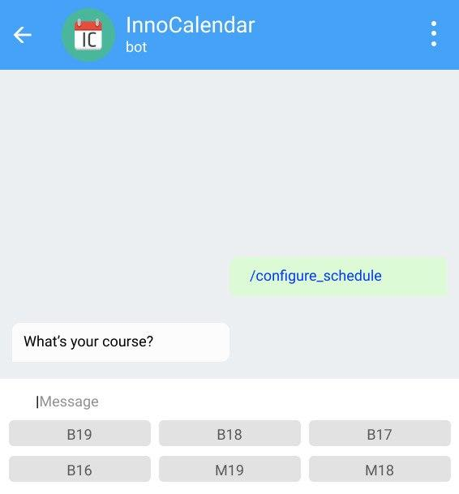
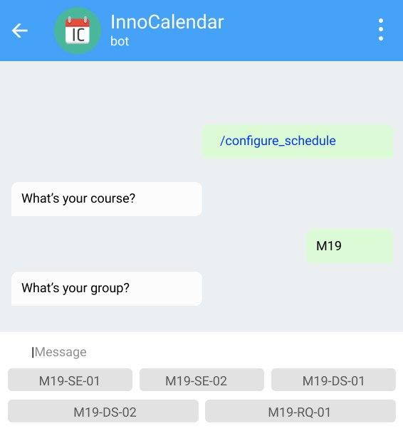
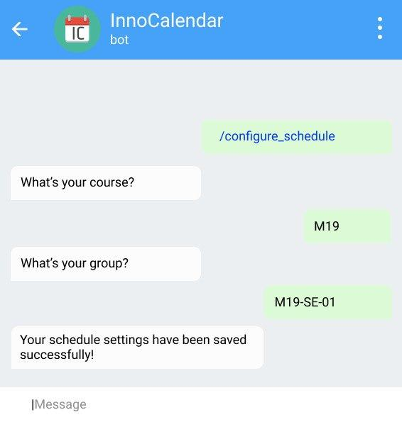
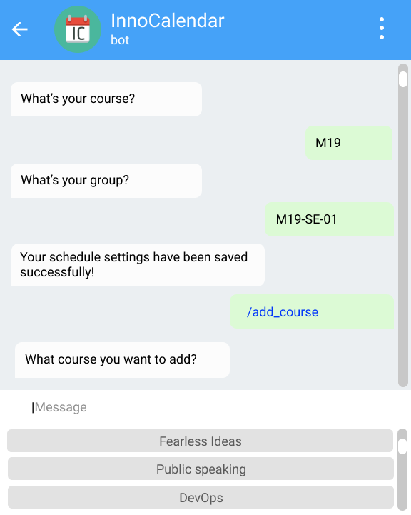
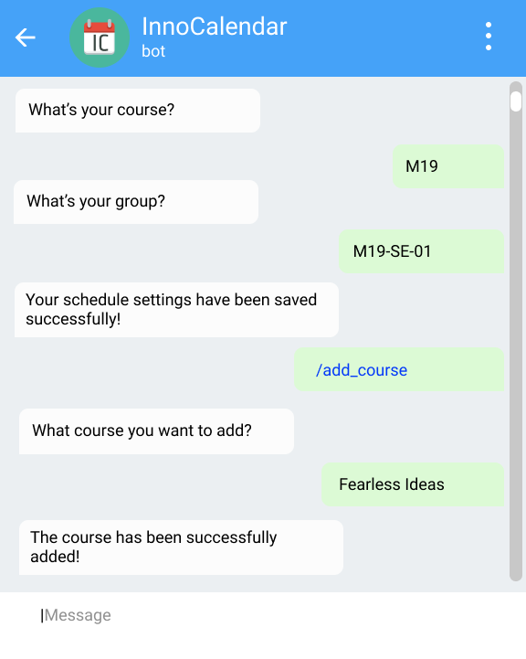
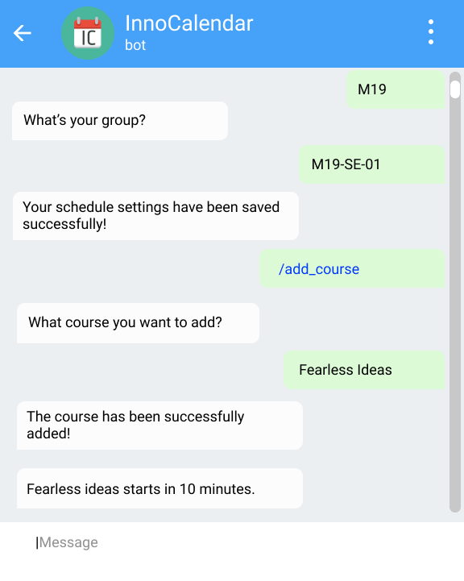
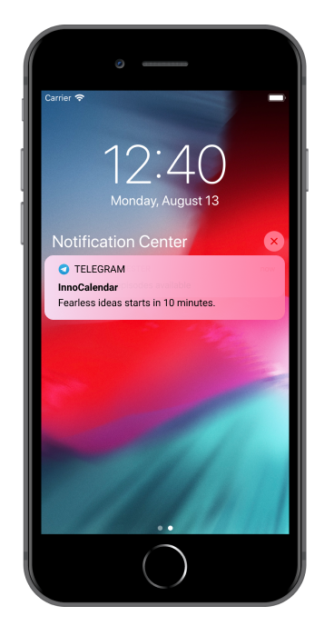

**Table of content**

[Project Description](#project-description)

[Mockup & description](#mockup-description)

> [Use Case: "Subscribe for an initial core
> program"](#use-case-subscribe-for-an-initial-core-program)
>
> [Use Case: "Subscribe to a course"](#use-case-subscribe-to-a-course)
>
> [Use Case: "Receive notification"](#use-case-receive-notification)
>
> [Use Case: "Update schedule"](#use-case-update-schedule)

Project Description
-------------------

InnoCalendar is an app for syncronizing academic schedules (core &
electives lessons) and to receive notifications on any changes or
updates on those courses. The application works as a Telegram bot. The
primary actor/user is the student who needs to get notified when there
are some changes in their schedules.

There were four Use Cases
([[https://github.com/VASemenov/InnoCalendar/blob/master/Requirements/Use\_Cases\_InnoCalendar\_v2.0.docx]](https://github.com/VASemenov/InnoCalendar/blob/master/Requirements/Use_Cases_InnoCalendar_v2.0.docx))
which the Mockups are based on:

1.  Subscribe for an initial core program.

2.  Subscribe to a course.

3.  Receive notification.

4.  Update schedule.

Mockup & description
--------------------

[### Use Case: "Subscribe for an initial core program"](https://github.com/VASemenov/InnoCalendar/blob/master/Code/InnoSchedule/modules/schedule/source.py)

> The purpose of this use case is that the student can choose the
> initial core program. The student writes the command
> "/configure\_schedule" to the bot (see Figure 1). The bot, in return,
> gives the student the possibility to select different buttons
> corresponding to the programs offered by Innopolis University (see
> Figure 2). By pressing one of them, the user selects the program, and
> the bot saves it. Additionally, the bot asks for the specific group
> and year by offering different Buttons again. The bot saves the user
> choice and shows the success message (see Figure 3).
>
> 
>
> Figure 1
>
> 
>
> Figure 2
>
> 
>
> Figure 3

[### Use Case: "Subscribe to a course"](https://github.com/VASemenov/InnoCalendar/blob/822ce85b9efde3b0ccb1bba3cd61699d3140ae1c/Code/InnoSchedule/modules/electives_schedule/controller.py#L44)

> By issuing the command "/add\_course", the student can add any course
> offered by Innopolis University to the personal list. The bot responds
> with the list of courses as different buttons, and the student can
> select one (see Figure 4). After the student chose a course, the bot
> shows the success message (see Figure 5).
>
> 
>
> Figure 4
>
> 
>
> Figure 5

[### Use Case: "Receive notification"](https://github.com/VASemenov/InnoCalendar/blob/master/Code/InnoSchedule/modules/remind/controller.py)

> The student receives a notification in case of time/place changes (see
> Figure 6 and Figure 7). There is no input from the student.
>
> 
>
> Figure 6
>
> 
>
> Figure 7

### Use Case: "Update schedule"

> This Use Case does not need any mockup because the activity will work
> as the background process for updating the schedule periodically.
