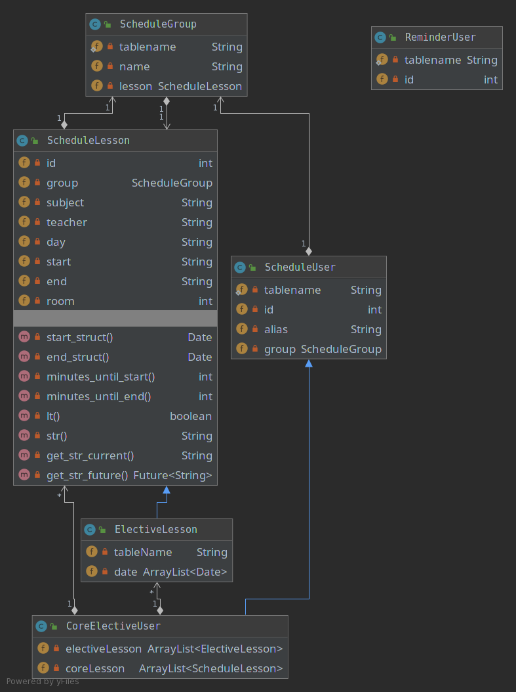

{width="4.908083989501312in"
height="6.567708880139983in"}

### Note

As the system we are creating, according to the requirements is a
telegram bot, it should be written in Python language, for which a class
diagram is generated ignoring methods and attributes.

So, in the real implementation, there will be a slight difference in
attributes names, they will be called starting with underscores.
